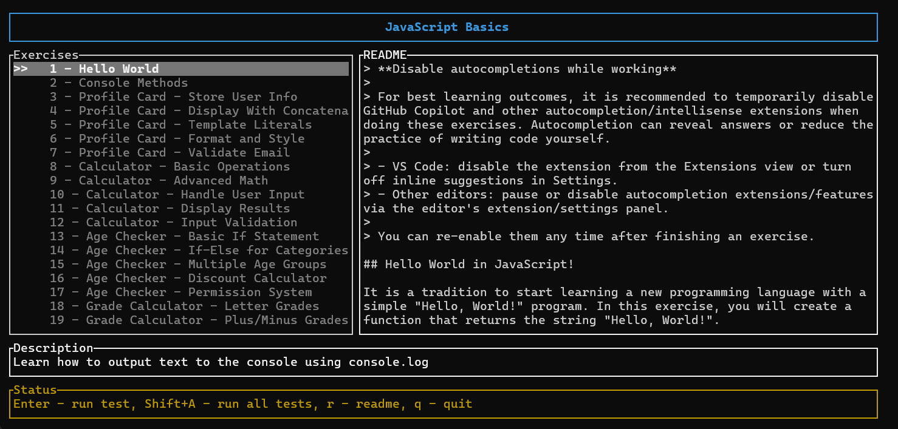

# Learn Programming
## Teach Programming To The World

This is simple TUI CLI application built in Rust which help you consume **course repos**.

## Features
* Dual panel interface with README preview
* Running tests running with single keystroke
* Hints with Ollama in case of failing tests (you have to install Ollama and at least one model)